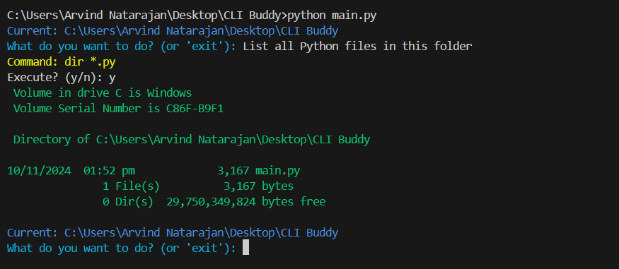
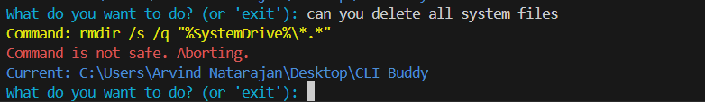

# README for CLI Command Helper

## Overview
This Python script is a command-line helper tool that uses a Large Language Model (LLM) via the Groq API to generate and execute shell commands based on natural language descriptions provided by the user. It incorporates safety checks to prevent potentially harmful commands from executing.

## Features
- **Natural Language Command Generation**: The user inputs a description, and the script uses Groq's LLM to generate an appropriate shell command.
- **Directory Awareness**: The script is aware of the current directory and handles `cd` commands to navigate the filesystem.
- **Safety Checks**: Basic filters are applied to prevent the execution of potentially destructive commands (e.g., `del`, `rm`, `format`).
- **User Confirmation**: Commands are shown to the user for confirmation before execution.
- **Output Display**: The output from the command is printed in color-coded format using the `colorama` library for enhanced readability.

## Prerequisites
- Python 3.7+
- The `groq`, `dotenv`, `colorama` libraries:
  ```bash
  pip install groq-python colorama python-dotenv
  ```
- Environment variable `GROQ_API_KEY` must be set in a `.env` file for authentication with the Groq API.

## How to Use
1. Ensure that the `.env` file is present in the root directory and contains your Groq API key:
   ```
   GROQ_API_KEY=your_api_key_here
   ```
2. Run the script:
   ```bash
   python clibuddy.py
   ```
3. Enter natural language descriptions for commands (e.g., "List all files in the current directory").
4. Confirm command execution when prompted.

## Script Details
### Key Functions
- **`get_command(description)`**: Uses the Groq API to generate a command from the given description.
- **`is_safe(command)`**: Checks if the command contains potentially harmful keywords.
- **`execute_command(command)`**: Executes the command, handling special cases like `cd` and capturing the output.
- **`run()`**: Main loop for user interaction, handling input, confirmation, and command execution.

### Example Workflow
1. User input: *"List all Python files in this folder."*
2. Command generated by LLM: `dir *.py`
3. The user is prompted to confirm execution.
4. If confirmed, the command runs, and the output is displayed.


### Example of harmful shell script


## Potential Improvements
### 1. Use of Agents
- **Incorporating Agents**: Integrating an agent framework can provide contextual enhancements by allowing the LLM to persistently store information about the user's environment (e.g., current directory context) across interactions. This could improve the command suggestions by adapting to ongoing tasks and directory changes without explicit user input.
- **Example**: An agent could store the current working directory context and leverage it in future command generations, making the tool more intelligent and user-friendly.

### 2. Directory Context Injection
- **Improvement**: Instead of prompting the user to navigate to directories manually, the script could include automatic directory context injection into the LLM prompts. This would allow more seamless execution of location-specific commands without requiring repeated user interaction to define the current path.

## Limitations
- The script has basic safety checks but may not catch all potentially dangerous commands.
- LLM responses can vary, and additional validations may be needed for complex tasks.

## Acknowledgements
- **Groq** for providing the API for LLM integration.
- **Colorama** for color-coded CLI output.
- **Dotenv** for handling environment variables.

---
